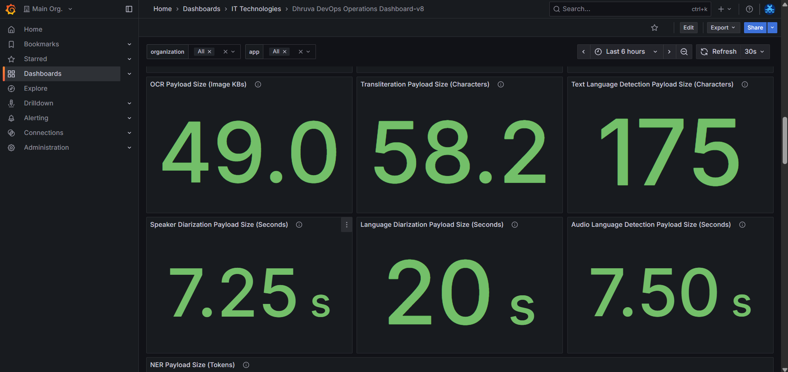
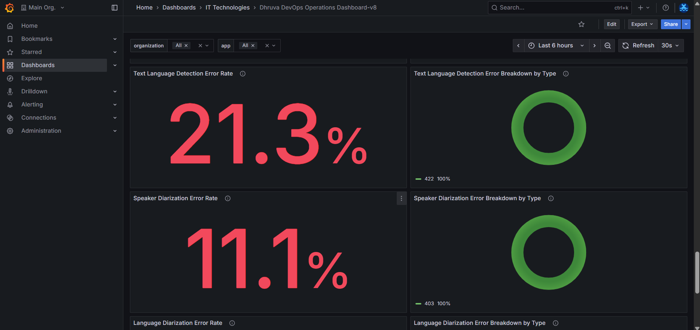
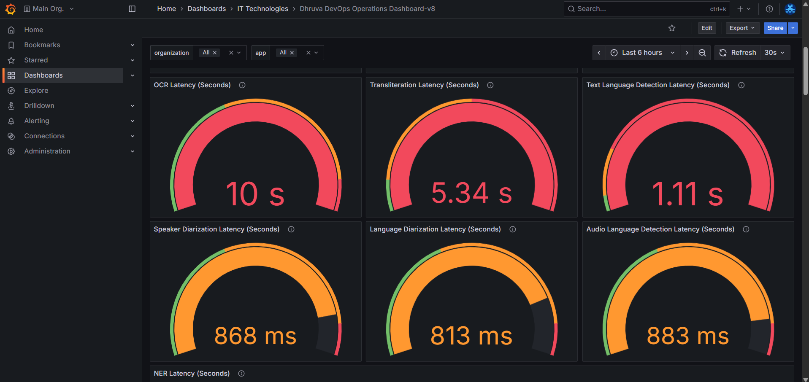
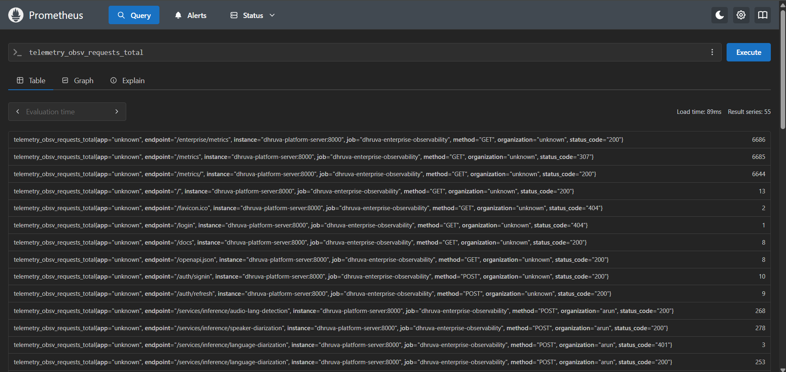

# observe-util

> **Enterprise-grade monitoring and metrics collection for Dhruva Platform deployments**

---

## 🎯 Overview

The `observe-util` package provides comprehensive observability, monitoring, and metrics tracking for FastAPI applications. It enables **multi-tenant metrics collection** with organization-level isolation, automatic service detection, and real-time analytics through Prometheus and Grafana.

This package is designed for the **Dhruva Platform** and provides plug-and-play monitoring capabilities.

---

## ✨ Key Features

- **Multi-tenant metrics collection** with organization-level isolation
- **Automatic service detection** (Translation-NMT, Text to Speech-TTS, Speech to Text-ASR, Image to Text-OCR, Named Entity Recognition-NER, Transliteration, Text Language detection, Speaker Diarization, Language Diarization, Audio Language Detection)
- **Real-time monitoring** via Prometheus and Grafana
- **Metrics Configuration**: Three built-in metrics for Latency, Error rate, Payload Size and the ability to configure customised metrics
- **Business metrics** - Characters, Tokens, Audio Length, Image size processed
- **Easy integration** - Few lines of code to get started
- **Plug-and-play** - Works with any FastAPI application
- **Grafana Dashboards**: Pre-configured dashboard templates

---

## 📊 Grafana Dashboard Screenshots

Get a visual overview of the monitoring capabilities provided by `observe-util`. The pre-configured Grafana dashboards offer comprehensive insights into your application's performance, errors, and resource usage.

### Payload Size Metrics

Track the volume of data processed by each service with real-time payload size metrics.

### Error Rate Monitoring

Monitor service health with real-time error rate tracking and detailed breakdowns by error type. The dashboard provides percentage-based error rates and visualizations showing the distribution of different error types. 

### Latency Metrics

Visualize service performance with color-coded gauge charts displaying latency metrics for all services. The gauges provide instant visual feedback with green (good), orange (warning), and red (critical) performance thresholds.

---

## 🔍 Prometheus Metrics

The `observe-util` package exposes metrics in Prometheus format, enabling detailed querying and analysis of your application's telemetry data. All metrics are collected with multi-tenant support, allowing you to filter and analyze data by organization, service, endpoint, and more.

### Metrics Query Example

Query the `telemetry_obsv_requests_total` metric to analyze request patterns, view request counts across different endpoints, organizations, and HTTP status codes. This enables detailed analysis of API usage patterns and service health.

---

Please check https://github.com/COSS-India/observe-util/wiki for detailed documentation

